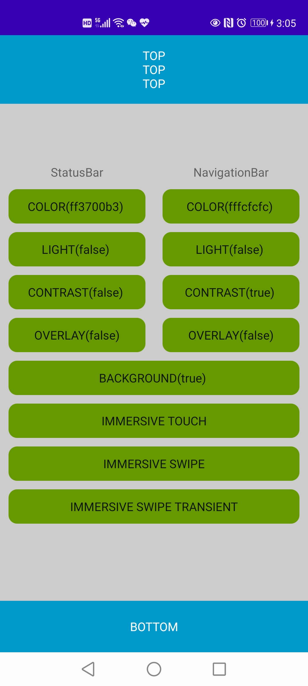

# SystemBars

系统栏工具库

- 设置系统栏背景色
- 设置覆盖在应用内容上
- 设置系统栏浅色模式
- 设置是否在系统纺栏颜色为0时，显示默认的系统栏半透明背景
- 设置沉浸式系统栏
    - 向后倾斜模式 - 触摸屏幕重新显示系统栏
    - 沉浸模式 - 滑过屏幕边缘重新显示系统栏
    - 粘性沉浸模式 - 滑过屏幕边缘重新显示系统栏并在数秒后重新隐藏，此方式无法收到系统栏的可见性变化事件
- 适配 Android R(API30)
- 最低要求 API21+

## Gradle

``` groovy
repositories { 
    maven { url "https://gitee.com/ezy/repo/raw/android_public/"}
} 
dependencies {
    implementation "me.reezy.jetpack:systembars:0.4.0" 
}
```

## Screenshot

 


## LICENSE

The Component is open-sourced software licensed under the [Apache license](LICENSE).
