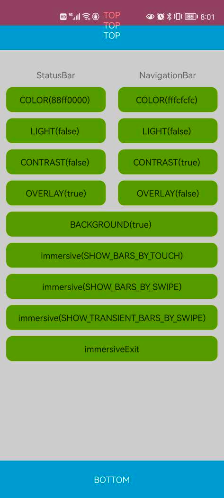

# SystemBars

系统栏工具库

- 设置系统栏背景色
- 设置系统栏覆盖在应用内容上
- 设置系统栏浅色模式
- 设置是否在系统栏颜色为0时，显示默认的系统栏半透明背景
- 设置沉浸式系统栏
    - 向后倾斜模式 - 触摸屏幕重新显示系统栏
    - 沉浸模式 - 滑过屏幕边缘重新显示系统栏
    - 粘性沉浸模式 - 滑过屏幕边缘重新显示系统栏并在数秒后重新隐藏，此方式无法收到系统栏的可见性变化事件
- 适配 Android R(API30)
- 最低要求 API21+

系统栏与沉浸式
https://juejin.cn/post/6904545697552007181



## Gradle

``` groovy
repositories { 
    maven { url "https://gitee.com/ezy/repo/raw/cosmo/"}
} 
dependencies {
    implementation "me.reezy.cosmo:systembars:0.8.0"
}
```

## API

```kotlin 
interface Bar {
    // 设置系统栏背景色
    fun color(@ColorInt color: Int): Bar

    // 设置系统栏覆盖在应用内容上
    fun overlay(value: Boolean = true): Bar
    
    // 设置系统栏浅色模式
    fun light(value: Boolean = true): Bar

    // 设置是否在系统纺栏颜色为0时，显示默认的系统栏半透明背景
    fun contrast(value: Boolean = true): Bar
}


fun Activity.systemBars(): Bar = SystemBars(window)
fun Fragment.systemBars(): Bar = SystemBars(requireActivity().window)
fun Dialog.systemBars(): Bar = SystemBars(window!!)

fun Activity.statusBar(): Bar = StatusBar(window)
fun Fragment.statusBar(): Bar = StatusBar(requireActivity().window)
fun Dialog.statusBar(): Bar = StatusBar(window!!)

fun Activity.navigationBar(): Bar = NavigationBar(window)
fun Fragment.navigationBar(): Bar = NavigationBar(requireActivity().window)
fun Dialog.navigationBar(): Bar = NavigationBar(window!!)

// 进入沉浸式
fun Window.immersive(barsBehavior: Int = WindowInsetsControllerCompat.BEHAVIOR_SHOW_TRANSIENT_BARS_BY_SWIPE)

// 退出沉浸式
fun Window.immersiveExit()

var Window.isDrawsSystemBarBackgrounds: Boolean

var Window.isStatusBarOverlay: Boolean
var Window.isStatusBarLight: Boolean

var Window.isNavigationBarOverlay: Boolean 
var Window.isNavigationBarLight: Boolean


```


## LICENSE

The Component is open-sourced software licensed under the [Apache license](LICENSE).
